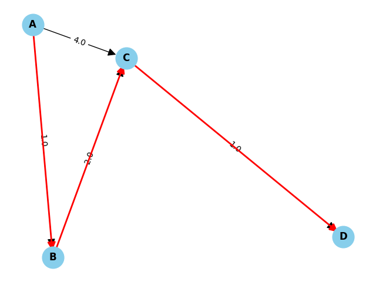

# Dijkstra's Shortest Path Algorithm

This folder contains an implementation of Dijkstra's algorithm to find the shortest paths in a graph.


## Table of Contents
- [Overview](#overview)
- [Graph Representation](#graph-representation)
- [Usage](#usage)
- [Time Complexity](#time-complexity)
- [Implementation Details](#ismplementation-detail)


## Overview
Dijkstra's algorithm is a graph search algorithm that solves the single-source shortest path problem for a graph with non-negative edge path costs.


## Graph Representation
The graph is encapsulated using three primary classes:
- Node: A singular node in the graph.
- Edge: A connection between two nodes with a weight.
- Graph: The main graph structure holding all nodes and edges.

Note: While a graph can be classified as [directed](../graph_lib/directed_graph.py) or [undirected](../graph_lib/undirected_graph.py), it's worth mentioning that an undirected graph is essentially a specific type of directed graph.



## Usage
To employ Dijkstra algorithm:

```python
graph = DirectedGraph() # Add nodes and edges accordingly
dijkstra = Dijkstra(graph)
shortest_paths = dijkstra.find_shortest_paths("A")
```

The result is a dictionary mapping node IDs to a tuple of shortest distance and predecessor node ID. Refer to the [unit test](../../tests/test_dijkstra/test_dijkstra.py).


## Time Complexity
- Extracting the node with the minimum distance from the priority queue takes O(logN) time and occurs N times.
- Updating the distance for a neighboring node takes O(logN) time and can potentially occur E times.
- *The tricky part*: the current implementation of the `get_edge_between` method in the Graph classes has a time complexity of O(E). Consequently, the aforementioned step has a complexity of O(E * max(logN, E)), which might become highly inefficient for a dense graph, as E could approach N * (N - 1) / 2. As an area of improvement, we should consider refining the Node class API to efficiently retrieve an edge given two nodes.
- The implemented Dijkstra's algorithm ideally should have a time complexity of O((N + E) * logN).
- N: number of nodes in the graph.
- E: number of edges in the graph.


## Implementation Details
- Switch to using a `set` for `unvisited_nodes` instead of a `list`. This is because the time complexity for element removal in a set is O(1), while it's O(N) for a list.
- In an optimal scenario, we wouldn't need `unvisited_nodes` and could rely solely on checking the emptiness of priority_queue. However, the heapq module in Python's standard library lacks an efficient mechanism to update the priority of an existing item. Consequently, when a new distance value for a node is pushed onto the heap, the previous value remains unaltered, leading to potential redundancies. This makes the current implementation slightly less efficient than desired due to these superfluous entries.
